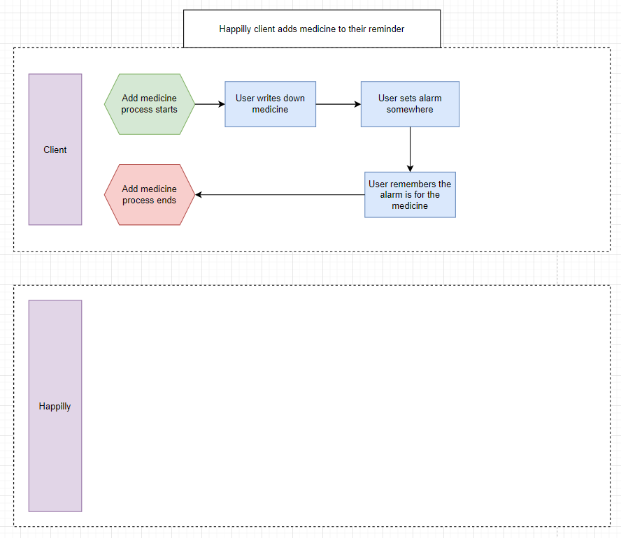
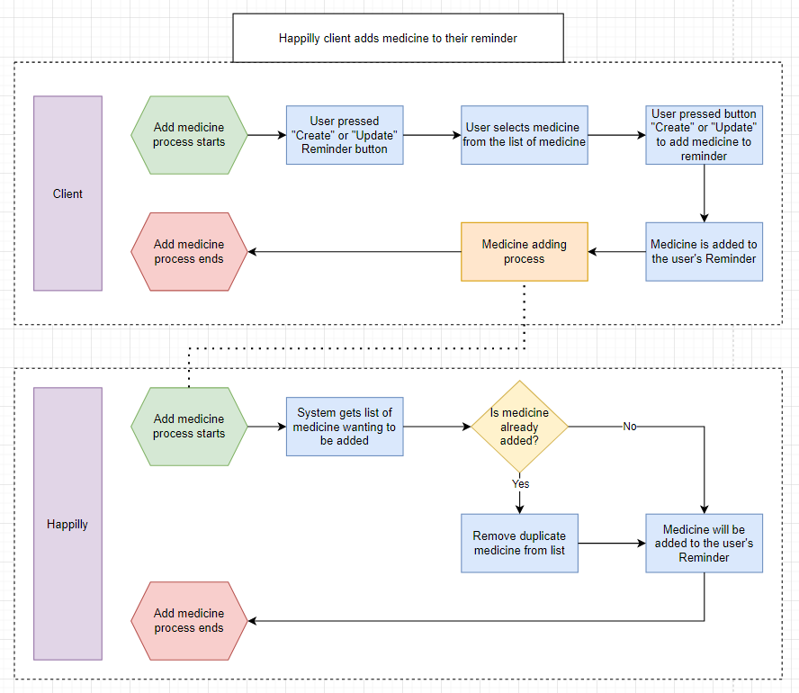

# Business process
I created two business processes for Happilly, one with and one without Happilly.

This is an example business process for adding medicine to a reminder without Happilly.

There is a few problems with the current process. The client would have to keep track of their own medicine on a piece of paper or on their phone and when they would want to set an alarm/reminder for it they would have to use another "Tool" like a phone or a physical alarm. And remembering which medicine to take is harder when you have a lot of them to take.

This is an example business process for adding medicine to a reminder.

With Happilly the problem above is eliminated. Happilly will keep the list of medicine for you in store and you can create your own reminders and add the medicine/supplements needed. The app can also keep stock for the medicine so you dont have to worry about forgetting to refill on time.

## Workshop business process and userstory mapping
A few of students from our class, including myself, created and gave a workshop to educate others about business process and user story mapping. The materials, including the presentation we used, can be accessed by visiting the link [here](https://github.com/fontys-open-up/2223nj-db03/tree/main/user-story-mapping-workshop). Through this workshop, I have demonstrated my understanding and proficiency in these topics.
