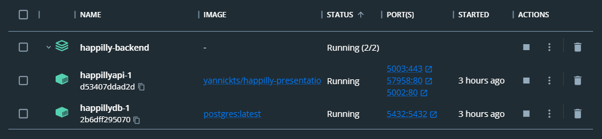

# Continuous Integration and Deployment (CICD)
I set up a continuous integration and continuous deployment pipeline using Github actions CI/CD for both my API and ORM database. This pipeline automatically runs tests and deploys my application when changes are made and pushed to the main or development branches. To ensure security, I added secret variables for sensitive information such as passwords and keys. Pushing changes to the main branch will trigger a build, deployment, testing and analysis.

## Containerization
I am using Docker to simplify the deployment process for my application. I have created a Dockerfile for the back-end components and database of my application to containerize them.

### CICD
```Dockerfile
# Dockerfile
FROM mcr.microsoft.com/dotnet/aspnet:6.0 AS base
WORKDIR /app
EXPOSE 80
EXPOSE 443

FROM mcr.microsoft.com/dotnet/sdk:6.0 AS build
WORKDIR /src
COPY ["Happilly.Presentation/Happilly.Presentation.csproj", "Happilly.Presentation/"]
COPY ["Happilly.Persistence/Happilly.Persistence.csproj", "Happilly.Persistence/"]
COPY ["Happilly.Application/Happilly.Application.csproj", "Happilly.Application/"]
COPY ["Happilly.Domain/Happilly.Domain.csproj", "Happilly.Domain/"]
RUN dotnet restore "Happilly.Presentation/Happilly.Presentation.csproj"
COPY . .
WORKDIR "/src/Happilly.Presentation"
RUN dotnet build "Happilly.Presentation.csproj" -c Release -o /app/build

FROM build AS publish
RUN dotnet publish "Happilly.Presentation.csproj" -c Release -o /app/publish

FROM base AS final
WORKDIR /app
COPY --from=publish /app/publish .
ENTRYPOINT ["dotnet", "Happilly.Presentation.dll"]
```

```yaml
# docker-compose.yml
version: "3.9"
services:
  happillyapi:
    build:
      context: .
      dockerfile: Happilly.Presentation/Dockerfile
    depends_on:
      - "happillydb"
    ports:
      - "5002:80"
      - "5003:443"
    networks:
      - happilly-network
    image: yannickts/happilly-presentation:latest
    restart: always
  happillydb:
    image: "postgres"
    restart: always
    environment:
      - POSTGRES_USER=postgres
      - POSTGRES_PASSWORD=postgres 
    ports:
      - "5432:5432"
    volumes:
      - db:/var/lib/postgresql/data
    networks:
      - happilly-network

volumes:
  db:
    driver: local

networks:
  happilly-network:
    driver: bridge
```
When im ready to start the container, I will run this docker-compose file which will start the app and the database containers on the specified ports. The database container will have a Docker Volume so that no data will be lost when the container is stopped or removed. Since the back-end won't work without a database, I've specified that the backend depends on the database so that it will first wait for a connection to establish before it will start working. Because both containers are made with the same file, it will also create a network for them to run under so that they can communicate with eachother without using its external IP address seen in the image below of docker. I also use the internal port for the database since it runs on my pc, because I wanted to see its contents with DataGrip as seen in the image below.




```yaml
# docker-compose-override.yml
version: '3.9'

services:
  happillyapi:
    environment:
      - ASPNETCORE_ENVIRONMENT=Development
      - USER_SECRETS_ID=d1c5237ed-074231c-441230b8-8944fd-0a04123dc # <- not my actual ID 
    ports:
      - "80"
    volumes:
      - $APPDATA/Microsoft/UserSecrets/$USER_SECRETS_ID:/root/.microsoft/usersecrets/$USER_SECRETS_ID
      - $HOME/.microsoft/usersecrets/$USER_SECRETS_ID:/root/.microsoft/usersecrets/$USER_SECRETS_ID
```
This is the docker compose override file where I use user secrets to make the cicd more secure so that no sensitive data will be exposed.

## Pipeline

```yaml
# Sonar Cloud build.yml
name: SonarCloud
on:
  push:
    branches:
      - main
  pull_request:
    types: [opened, synchronize, reopened]
jobs:
  build:
    name: Build and analyze
    runs-on: ubuntu-latest
    steps:
      - name: Set up JDK 11
        uses: actions/setup-java@v1
        with:
          java-version: 1.11
      - uses: actions/checkout@v2
        with:
          fetch-depth: 0  # Shallow clones should be disabled for a better relevancy of analysis
      - name: Cache SonarCloud packages
        uses: actions/cache@v1
        with:
          path: ~\sonar\cache
          key: ${{ runner.os }}-sonar
          restore-keys: ${{ runner.os }}-sonar
      - name: Install SonarCloud scanner
        run: |
          dotnet tool install --global dotnet-sonarscanner
          dotnet tool install --global dotnet-coverage
      - name: Build and analyze
        env:
          GITHUB_TOKEN: ${{ secrets.GITHUB_TOKEN }}  # Needed to get PR information, if any
          SONAR_TOKEN: ${{ secrets.SONAR_TOKEN }} 
        run: |
          dotnet-sonarscanner begin /k:"yannick-wk_Happilly-Backend" /o:"yannick-wk" /d:sonar.login="${{ secrets.SONAR_TOKEN }}" /d:sonar.host.url="https://sonarcloud.io" /d:sonar.cs.vscoveragexml.reportsPaths=coverage.xml
          dotnet build --no-incremental
          dotnet-coverage collect 'dotnet test' -f xml  -o 'coverage.xml'
          dotnet-sonarscanner end /d:sonar.login="${{ secrets.SONAR_TOKEN }}"
```

The job above is responsible for Building the application, it will run the tests using an in memory database in the back-end and analyze the code by using Sonar Cloud to check for the code quality. The results will then go to Sonar Cloud with a test coverage of the pushed code as seen in the image below. I'm also using secrets so that there is no sensitive user data exposed while running this file.

