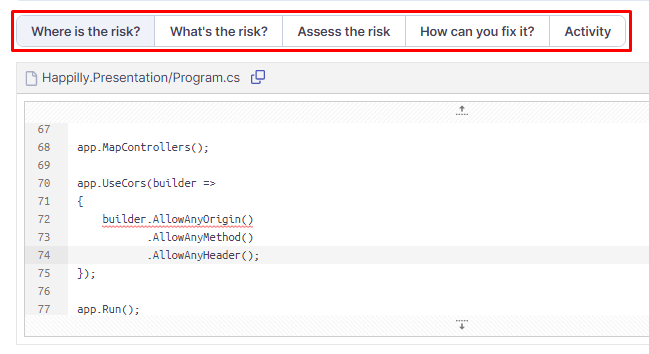

# How to implement CORS in Happilly?

## Table of content
- [Intro](#intro)
- [What is CORS?](#what-is-cors?)
- [How do resource requests work?](#how-do-resource-requests-work?)
- [How does CORS work?](#how-does-cors-work?)
- [What are the dangers surrounding CORS?](#what-are-the-dangers-surrounding-cors?)
- [How do I use CORS in my APIs?](#how-do-i-use-cors-in-my-apis?)
- [Conclusion](#conclusion)
- [References](#references)

## Intro
In semester 3 we're tasked with developing a web application. To keep the project loosely coupled and scalable, the project is made with the microservices architecture in mind. Due to this, each service will send a request from their own origin, which causes cross origin requests to happen. As an application should only allow access to specific services, this research will focus on how to implement CORS within the Happilly project.

## What is CORS?
Cross-Origin Resource Sharing (CORS) is a way for a server to allow web browsers to access resources from a domain other than the one the browser is currently on. It does this by using HTTP headers and a "preflight" request to check that the server hosting the cross-origin resource will allow the actual request to be made. The preflight request includes information about the HTTP method and headers that will be used in the actual request. This helps ensure that resources are only accessed from approved domains and that the server is aware of and okay with the request. For security reasons, browsers restrict cross-origin HTTP requests initiated from scripts.[[1]](#cors-mozilla)

While CORS adds flexibility to the same-origin policy (SOP) by enabling cross-domain access, but it also has the potential to create security vulnerabilities if a website's CORS policy is poorly configured or implemented. It is important to note that CORS does not provide protection against cross-origin attacks such as cross-site request forgery (CSRF).[[2]](#cors-protswigger)

## How do resource requests work?
Services can exchange data via network with HTTP (Hypertext Transfer Protocol), which defines the communication rules between the requester and the responder. Both the request and response messages are devided into a header and body.

The header contains the information regarding type of message or the encoding of the message. This information is stored as key-value pairs. The body contains the message itself in JSON, HTML, etc.[[3]](#cors-web-dev)

## How does CORS work?
The CORS workflow starts when a script one origin makes a request to another origin. `Origin A` will send a preflight request via HTTP to `Origin B`. `Origin B` then validates the preflight requests headers  if it is allowed to make the actual request. If the verification succeeds, then `Origin B` will respond with its own set of HTTP headers, which defines the range of acceptable origins, request methods, custom headers, if it's acceptable to send credentials and how long `origin A` should keep the response.[[4]](#cors-stackhawk)

*Workflow of a CORS requests*[[4]](#cors-stackhawk)

## What are the dangers surrounding CORS?
While enabling CORS on a service is better than not using it, there are still problems that could arise when you don't set it up correctly, which can lead to cross-origin attacks like mentioned before. A few commonly occuring vulnerablilities when setting up CORS are as follows:
- Using the asterisk (\*) value in the `Access-Control-Allow-Origin` header. This causes the CORS to allow any origin to access the service.
- Using the "null" value in the `Access-Control-Allow-Origin` header, thinking it will disable CORS. This will have the same effect as using the asterisk.
- Setting up a dynamic `Access-Control-Allow-Origin` with improper server-side validation. If set up improperly within a domain, this can lead to opening backdoors to unwanted visitors and requests.[[5]](#cors-vuln-tenable)

## How to use CORS in APIs?
Here's an example of how to use CORS in an API:

On the server side, you need to configure your API to return the Access-Control-Allow-Origin header in the response. The value of this header should be set to the domain(s) that should be allowed to make requests to the API. For example, to allow requests from any domain, you can set the header value to *.

Make sure that your API is set up to handle OPTIONS requests. These requests are automatically sent by the browser before making an actual GET or POST request, to check if the API allows CORS requests. Your API should return a 204 No Content status code and the Access-Control-Allow-Origin header in the response.

On the client side, you can use the fetch API or any other

## Conclusion
CORS is used in the Happilly API but it does not pose any security issues because its in a closed docker environment. I have learned what CORS is, what it does and it works and how to apply it in an API. In the screenshot below you can see the security hotspot I got before when running my code through sonar cloud. Using Sonar Cloud also gave me another source of knowing what the problem exactly was and how to fix it as seen in the tabs highlighted.

## References
> [1] <a name="cors-mozilla"/> _Cross-Origin Resource Sharing (CORS) - HTTP | MDN_. (2022b, December 5). https://developer.mozilla.org/en-US/docs/Web/HTTP/CORS

> [2] <a name="cors-portswigger"/> _What is CORS (cross-origin resource sharing)? Tutorial & Examples | Web Security Academy_. (n.d.). https://portswigger.net/web-security/cors

> [3] <a name="cors-web-dev"/> _Cross-Origin Resource Sharing (CORS)_. (n.d.). web.dev. https://web.dev/cross-origin-resource-sharing/

> [4] <a name="cors-stackhawk"/> _What is CORS?_ (n.d.). StackHawk. https://www.stackhawk.com/blog/what-is-cors/

> [5] <a name="cors-vuln-tenable"/> _Understanding Cross-Origin Resource Sharing Vulnerabilities_. (2020, September 11). Tenable®. https://www.tenable.com/blog/understanding-cross-origin-resource-sharing-vulnerabilities