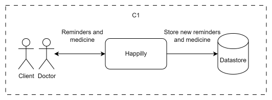
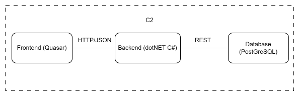
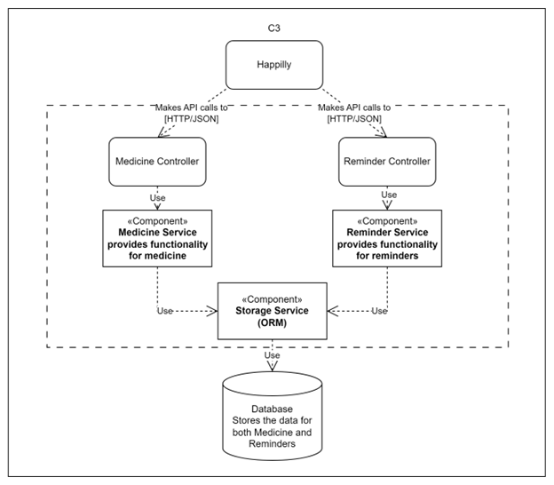

# Happilly Analysis
## Introduction 

For this third semester the assignment is to create a distributed application. I have chosen to make a medicine reminder application. The application will remind you to take your medicine by creating an alarm/reminder and assign medicine to it. If you are running low on your medicine, you can live chat with your doctor to get a new prescription or make an appointment. 

The requirements of this application will be listed with an importance level of ‘Must’, ‘Should’, ‘Could’. There will be User stories and also Quality attributes I wish to fulfill shown in the table below. The quality attributes of the system are shown in the table with categories used by the [ISO 250101](https://iso25000.com/index.php/en/iso-25000-standards/iso-25010)
 
## Requirements 
The requirements have been put together by using the MoSCoW method which can be found in the table below. The requirements will be divided into actions and rules. 

### Actions

| ID | Name                     | Description                              | Importance | Urgency | UC ID |
| -- | ------------------------ | ---------------------------------------- | ---------- | ------- | ----- |
| A1 | Create reminder          | To create a reminder                     | Must       | High    |       |
| A2 | Add medicine to reminder | To add medicine to the selected reminder | Must       | High    |       |
| A3 | Live Chat                | To live chat between doctor and patient  | Must       | High    |       |
| A4 | Edit/Delete reminder     | To edit/delete a reminder                | Must       | High    |       |
| A5 | Set reminder time        | To set the reminder time                 | Should     | Medium  |       |
| A6 | Set repeatable reminder  | To set repeatable reminder               | Should     | Medium  |       |
| A7 | Create note              | To create a note to write on             | Could      | Low     |       |
| A8 | Edit/Delete note         | To edit/delete a note                    | Could      | Low     |       |

### Rules

| ID | Description                                       | Importance | Urgency |
| -- | ------------------------------------------------- | ---------- | ------- |
| R1 | User must be logged in                            | Must       | High    |
| R2 | User must have medicine before creating reminders | Must       | Medium  |
| R3 | User must have Doctor added to live chat          | Must       | Medium  |

## User stories
+ I want to create a reminder so that I will not forget to take my medicine
+ I want to add medicine to my reminder to see which medicine I have to take.
+ I want to add medicine to my medicine list so I do not have to go through a massive list
+ I want to live chat with my doctor/patient so that I can make an appointment or prescribe more medicine.
+ I want to keep notes for myself and maybe share them later with my doctor

## Quality attributes
| ID  | Category ISO 25010 | Description                                                                                                    |
| --- | ------------------ | -------------------------------------------------------------------------------------------------------------- |
| Q1  | Performance        | The maximum latency is 400ms.                                                                                  |
| Q2  | Performance        | The maximum resources that the application can use is not more than 1GB.                                       |
| Q3  | Performance        |                                                                                                                |
| Q4  | Compatibility      | Documentation describing interfaces is available to show how components communicate.                           |
| Q5  | Usability          | The system can be used by anyone with a registered account.                                                    |
| Q6  | Reliability        | The system has a 99% uptime.                                                                                   |
| Q7  | Reliability        | The system is available at least 23 hours per day (online).                                                    |
| Q8  | Security           | Any data is securely sent to the server and clients.                                                           |
| Q9  | Maintainability    | The system is built modularly.                                                                                 |
| Q10 | Maintainability    | The source code is written according to the Microsoft code conventions2 for C# and the Java Code Conventions3. |
| Q11 | Maintainability    | Source code is documented.                                                                                     |
| Q12 | Maintainability    | At least 80% of the source code is covered by tests.                                                           |

## Architecture

### C1 System context 

The figure above shows the System Context Diagram. It shows the context of the software. The system
being built is shown as a Process, a user of the system is shown as an Entity and the storage system is
shown as a DataStore.

### C2 Containers and chosen technologies

The figure above shows the Container Diagram. In this diagram 3 different containers are involved with
the distributed reminder platform. The communication between the Backend and the Database uses a
RESTful API. The communication between the Frontend and the Backend uses HTTP/JSON.

### C3 Components

The figure above shows the Component Diagram. In this diagram it can be observed that Happilly has backend controllers that use services to
communicate to each component and the Database to store or fetch data.