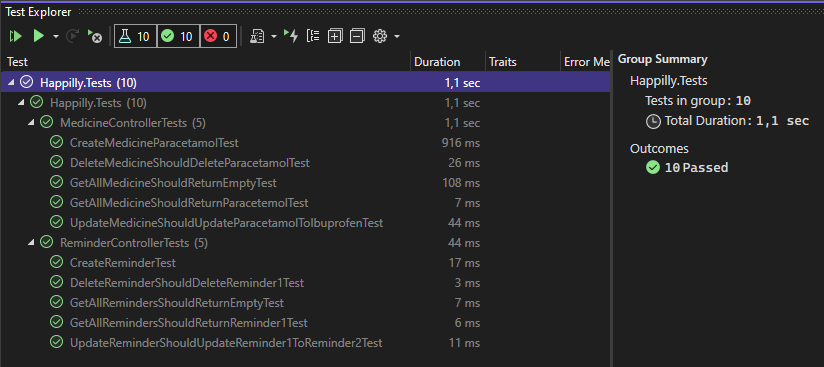
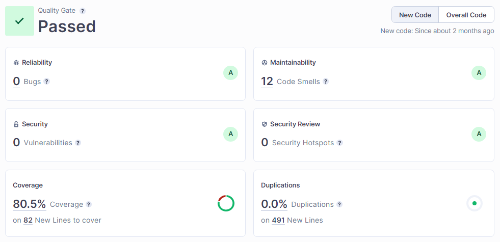
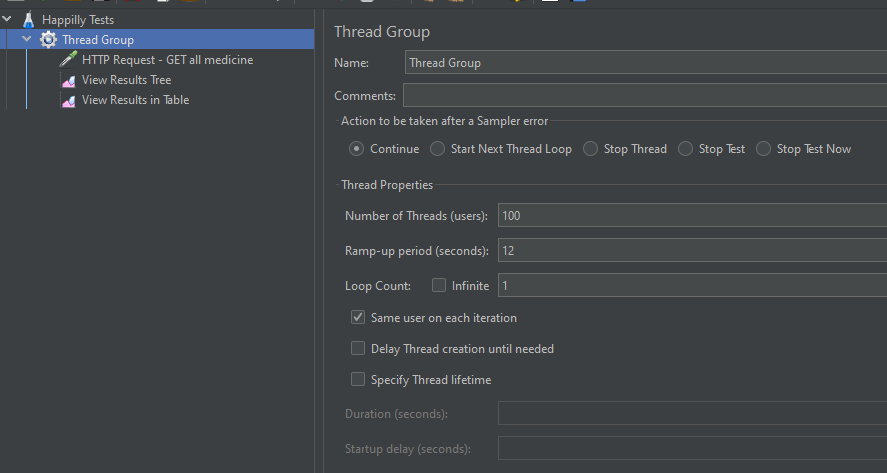
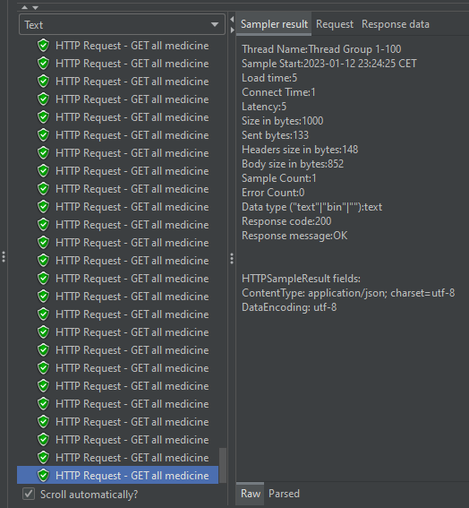
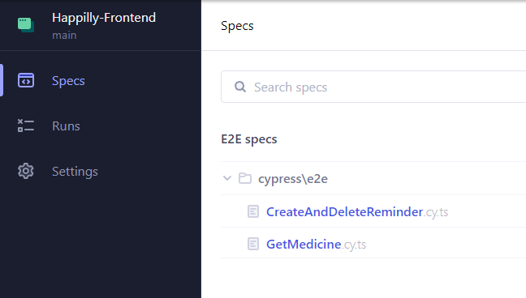
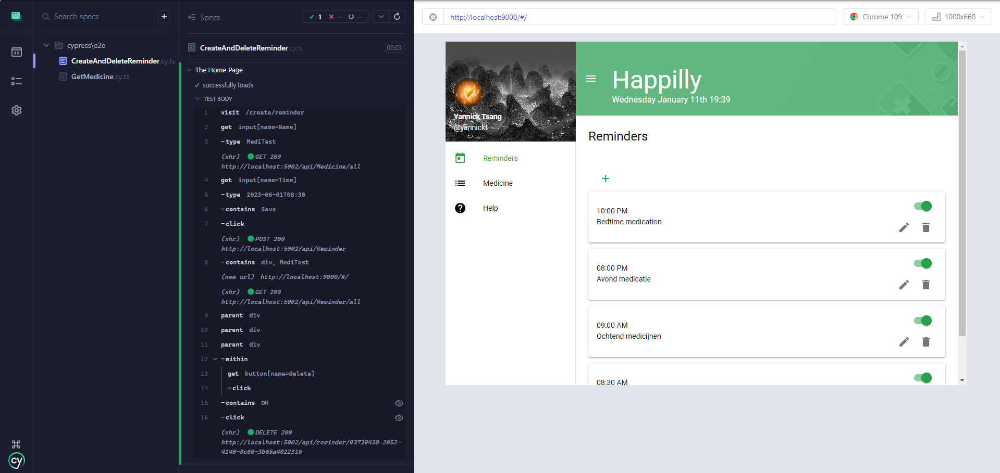
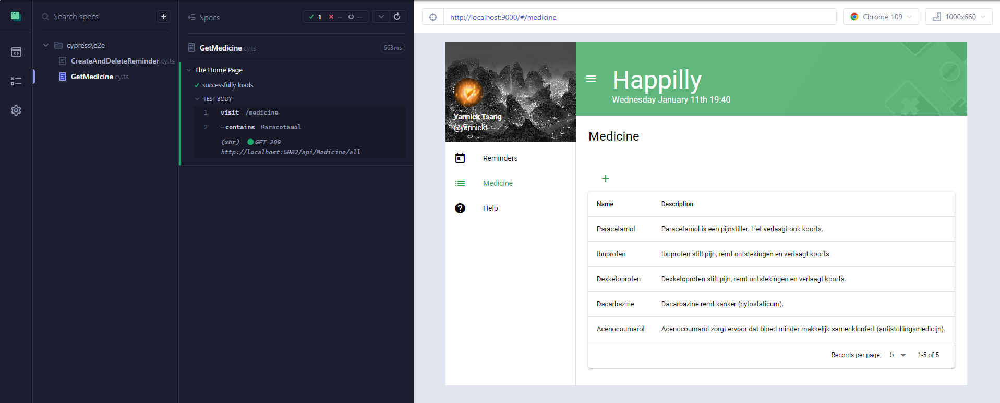

# Quality Assurance
## Table of content
- [What is QA?](#what-is-qa?)
- [Test Plan](#test-plan)
- [Integration tests](#integration-tests)
- [UX](#ux)
- [Sonar Cloud](#sonar-cloud)
- [JMeter](#jmeter)
- [Cypress](#cypress)
- [Reflection](#reflection)

## What is QA?
To ensure that Happilly functions correctly and performs optimally, I performed a variety of tests. These tests can be divided into two categories: functional and non-functional.

Functional tests focus on verifying that the code functions as expected, such as ensuring that when 1+1 is entered, the answer is 2. If these tests fail, it indicates that there is an error in the code that will prevent the app from functioning properly.

Non-functional tests, on the other hand, evaluate the quality of the code and app. These tests do not check if the app functions as intended, but rather assess how well it performs. Examples of non-functional tests include performance tests, which measure load times and responsiveness, and UX tests, which evaluate the user-friendliness and usability of the app's interface.

## Test Plan
For Happilly I am aiming to test as much as possible. The ideal percentage is around 80% of code coverage for the Functional tests. I will be writing integration tests for Happilly to test the CRUD functionality of the backend with a performance load test in JMeter and write tests with Cypress for end to end testing and frontend testing. For automated testing I'm going to use an In-memory database in the backend so that I can automatically run tests when pushing code to Github with Github actions more on this [here](cicd.md). The right status codes in Swagger are important when developing and testing the API actions so I want to make sure I send the right status codes with each action.

## Integration tests
I have implemented integration. All of my controllers are thoroughly tested through integration tests by executing their methods, ensuring that all layers of the application are tested. To prevent contamination of production data, I have used an in-memory database to run these tests.

When a push is made to GitHub, these are all the tests that are executed:



The image above is one of the integration tests from the back-end.
### Swagger
With testing the integration of the back-end I used Swagger and wanted the right status codes to be displayed if something was wrong, below is a a snippet of the code where I setup the right status codes: 
```C#
    [HttpGet, Route("all")]
    [ProducesResponseType(StatusCodes.Status200OK)]
    [ProducesResponseType(StatusCodes.Status400BadRequest)]
    [ProducesResponseType(StatusCodes.Status500InternalServerError)]
    public async Task<IEnumerable<MedicineDto>> GetAllAsync()
    {
        return await _medicineService.GetAllAsync();
    }

    [HttpGet, Route("{id:Guid}")]
    [ProducesResponseType(StatusCodes.Status200OK)]
    [ProducesResponseType(StatusCodes.Status400BadRequest)]
    [ProducesResponseType(StatusCodes.Status500InternalServerError)]
    public async Task<MedicineDto> GetByIdAsync(Guid id)
    {
        return await _medicineService.FindSingleOrDefaultAsync(id);
    }

    [HttpPost]
    [ProducesResponseType(StatusCodes.Status201Created)]
    [ProducesResponseType(StatusCodes.Status400BadRequest)]
    [ProducesResponseType(StatusCodes.Status500InternalServerError)]
    public async Task<ActionReturnObject> CreateMedicineAsync(MedicineDto medicine)
    {
        bool success = await _medicineService.CreateAsync(medicine);
        return new ActionReturnObject(success);
    }

    [HttpDelete]
    [ProducesResponseType(StatusCodes.Status200OK)]
    [ProducesResponseType(StatusCodes.Status400BadRequest)]
    [ProducesResponseType(StatusCodes.Status404NotFound)]
    [ProducesResponseType(StatusCodes.Status500InternalServerError)]
    public async Task<IActionResult> DeleteMedicineAsync(Guid id)
    {
        bool success = await _medicineService.DeleteAsync(id);
        return success ? Ok() : NotFound();
    }

    [HttpPut]
    [ProducesResponseType(StatusCodes.Status200OK)]
    [ProducesResponseType(StatusCodes.Status400BadRequest)]
    [ProducesResponseType(StatusCodes.Status500InternalServerError)]
    public async Task<IActionResult> UpdateMedicineAsync(MedicineDto medicine)
    {
        bool success = await _medicineService.UpdateAsync(medicine);
        return success ? Ok() : NotFound();
    }
```

## UX
I conducted user experience research to improve the usability of my application. The findings and results of this research can be accessed [here](ux-research.md).

## Sonar Cloud
I used Sonar Cloud to check code quality, the code will be uploaded and analyzed where every time a report is generated. Sonar Cloud is used to scan the codebase for coverage, duplications, bugs, and vulnerabilities. As outlined in my test plan, the coverage rate is as I wanted. An example of a report is provided down below. More about Sonar Cloud can be found [here](cicd.md) in the CICD document.


## JMeter
Website performance is critical as studies have shown that users tend to leave a site if it takes too long to load. To evaluate this, I have set up a system that generates a JMeter report every time a commit is made. The report contains valuable information on load time, response times, and other metrics, as well as best practices for optimizing website performance.

Here are some screenshots of what the load test looks like and the results it got:




## Cypress
I used Cypress to test the application from front to back-end by making an E2E (End to End) tests, in the images below you can see the two tests that were made.




## Reflection
Looking back at the semester I learned a lot about testing and types of testing. I figured out how to test with JMeter, Cypress and UX tests. I was already familiar with integration tests but I didn't make a lot of them in the past. Now I know how to and in the other types/programs. I struggled with integration tests the most because it was more about testing all the ins and outs of the back-end itself and where everything went through with each test/method.