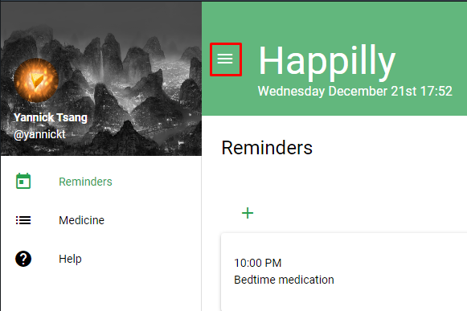
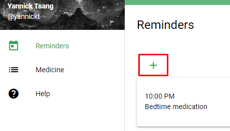
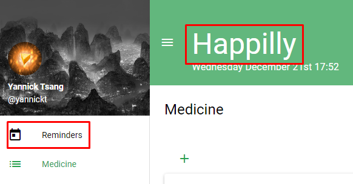

# UX Research

## Table of content
- [Intro](#intro)
- [Who tested my application?](#who-tested-my-application?)
- [What did I test?](#what-did-i-test?)
- [Testing results](#testing-results)
- [Conclusion](#conclusion)

## Intro 
I have researched User Experience (UX) because of its crucial role in website design. If a site is slow, confusing, or broken, users will quickly leave, which is why I conducted a UX survey to gather feedback on the usability of the site. My goal was to ensure that the users can navigate the site easily and understand the purpose of each feature. Additionally, throughout the development of the site, I received feedback from test users about issues with certain UI elements, but I had not fully documented these issues. The survey is also intended to gather more specific feedback on which elements of the UI users had difficulty with and how they could be improved.

## Who tested my application?
I conducted the usability tests on two groups of users: my family/relatives (3) and friends who are studying ICT / know what my app is (3). I chose to test with my family/friends because they have no prior knowledge of the application and may provide a fresh perspective on the usability of the site. They may identify issues that users who are already familiar with the application might overlook. By testing with a diverse group of users, I was able to gain a more comprehensive understanding of the usability of my application.

## What did I test?
As previously mentioned, I conducted an online/ in-person survey to assess the usability of my application. In the survey, I first asked participants if they were familiar with my application and if they had experience using a similar app, in order to separate the responses and compare feedback from different test groups. After that, I asked participants to spend a few minutes exploring the application, and attempted to locate every page and functionality, this help me to see how easily the user can navigate and find what they were looking for.

After exploring the application, participants were then asked specific questions about their user experience. I wanted to know their overall impression of the website, if they encountered anything unclear and what changes or additions they would suggest. I also asked more targeted questions about certain features and components of the application to gain more detailed feedback.

### Close the sidemenu

When the user clicked on the hamburger icon, it would close the sidebar. I found this useful for mobile use so that it doesnt clutter the screen. I didnt know if this was on obvious feature but when i asked the testers they all knew how to do it.

### Go to create reminder page

The second component to test was going to the create reminder page. By clicking on the + button on the left side of the page you were able to go there. A few users had trouble going there because the button wasnt big/clear enough to see. So I noted that down and changed it afterwards.

### Go back to reminder/home page from any other page

The last component I let them test was to go back to the reminder/home page. Many of the testers tried clicking on the Happilly logo on the top left but it didnt work. So the next thing those people did was clicking on the sidebar "Reminders" tab to go back. After they finished the test I asked them what needed to be added/changed and 5 out of 6 people said that the logo should be clickable to bring you back to the Reminder/Home page.

## Testing results
The results of the survey were very useful for me, they helped me understand the areas in which my application was lacking or confusing. The feedback also provided me with valuable ideas on how to improve the application.

### Family vs Friends
The feedback from family and friends differed significantly, as expected. family were more likely to be overwhelmed by the amount of tables tabs and buttons presented on the website and were more likely to ask basic questions about the application's terminology and features, while friends were already familiar with the app and its concept. Since this application is designed specifically for medication users, I will be making changes to those elements if really deemed useful. Some suggestions made by family were not technically feasible or beyond the scope of my application, and friends were aware of this limitation, hence they did not request it. However, family gave more feedback on visual elements, such as styling and layout, particularly on mobile devices, and have highlighted the need for more margins or borders on certain UI elements.

## Conclusion
As per the feedback received, it has been noted that the homepage is too hard to navigate to and it is too difficult to see some buttons. I need to simplify the majority of the elements to make it more user-friendly. Also, the logo functionality was not clear to the majority of participants, because on most websites it leads back to the home page, I need to make separate "back" and "back to reminders/medicine" buttons for better navigation. The medicine page was generally understood well, but minor UI changes were requested. The Reminder page needs to change a little bit as well. I will be implementing these changes and will be conducting another round of feedback to see if the problems are resolved.
